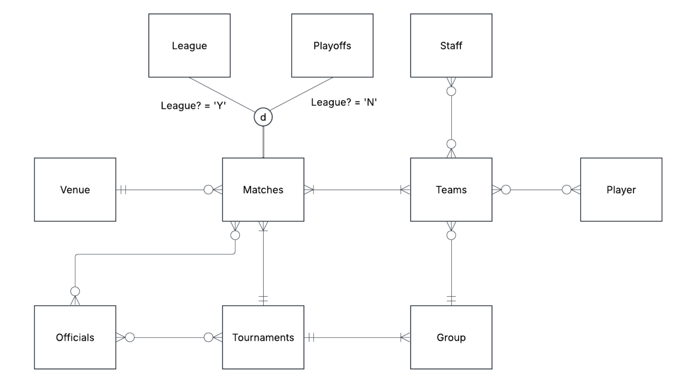
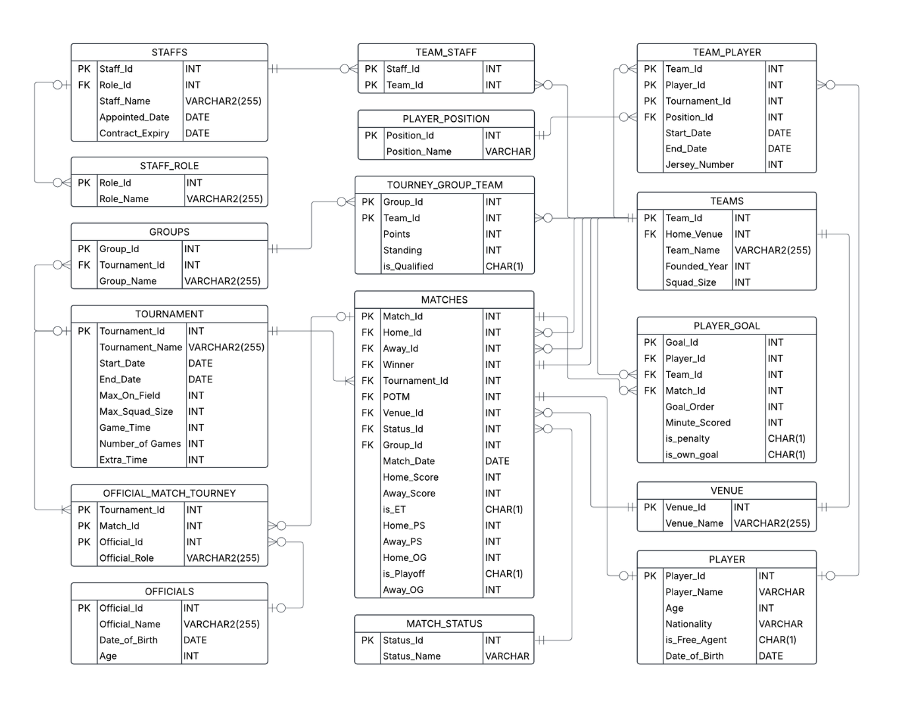

# G.O.A.T DB — Sports Database Management System

An Oracle SQL database for tracking football matches, teams, players, and tournaments. 

---

## Entity Relationship Diagram



---

## Relational Schema



---

## Schema

15+ tables organized across five domains:

| Domain | Tables |
|---|---|
| Teams & Staff | `TEAMS`, `STAFF`, `STAFF_ROLE`, `TEAM_STAFF` |
| Players | `PLAYER`, `PLAYER_POSITION`, `TEAM_PLAYER` |
| Tournaments | `TOURNAMENT`, `GROUPS`, `TOURNEY_GROUP_TEAM`, `TOURNEY_TEAM` |
| Matches | `MATCHES`, `MATCH_STATUS`, `VENUE` |
| Match Events | `PLAYER_GOAL`, `OFFICIALS`, `OFFICIAL_MATCH_TOURNEY` |

---

## Features

**Triggers**
- `SET_MATCH_WINNER` — auto-determines match result (win/draw/penalty) on insert or update
- `SET_PLAYER_AGE` / `SET_OFFICIAL_AGE` — computes age from date of birth
- `UPDATE_TEAM_POINTS_I` / `UPDATE_TEAM_POINTS_U` — maintains group standings points automatically

**Views**
- `TOP_10_SCORERS` — top scorers with penalty and own-goal breakdowns
- `TEAM_PERFORMANCE_REPORT` — wins, losses, draws, goals scored/conceded, and standings per tournament
- `TOURNAMENT_SUMMARY_REPORT` — team count, match count, and total goals per tournament
- `PENALTY_DECIDED_MATCHES` — matches decided by penalty shootout

**Security**
Five user roles with scoped privileges on the `MATCHES` table:

| Role | Privileges |
|---|---|
| `admin_user` | Full DBA access |
| `readonly_user` | SELECT |
| `data_entry_user` | INSERT, UPDATE |
| `data_mod_user` | INSERT, UPDATE, DELETE |
| `limited_view_user` | SELECT |


---

## Sample Data

Covers the **2023–24 season** across five competitions:
- Premier League
- FA Cup
- UEFA Champions League
- Carabao Cup
- FIFA Club World Cup

12 English clubs seeded (Man United, Man City, Chelsea, Arsenal, Liverpool, Tottenham, and more), with real players, staff, venues, and match officials.

### Tournament Summary


### Team Performance


### Top 10 Scorers


---

## Files

| File | Description |
|---|---|
| `QUERIES.txt` | Main development script — schema, inserts, triggers, views, security |
| `SQL QUERIES.txt` | Oracle Data Pump export — full DDL with constraints, indexes, and data |
| `IS680 Sec 01 Group Project.docx` | Project report and documentation |

---

## Setup

Requires an **Oracle Database** instance. Run against your schema:

```sql
-- 1. Create tables
-- 2. Create triggers
-- 3. Create views
-- 4. Insert data
@QUERIES.txt
```

Or import the full dump via Oracle SQL Developer / Data Pump using `SQL QUERIES.txt`.
